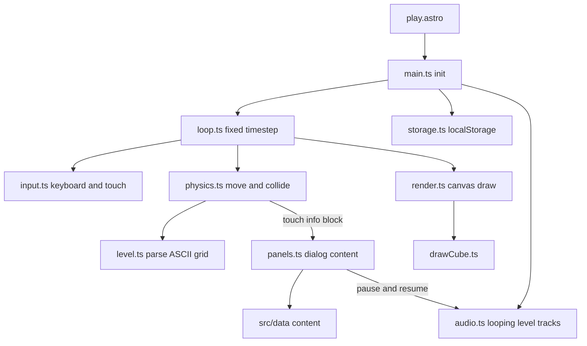

# Blue5GD Portfolio -- Build Plan

## 0. Ground rules for the builder

- **Where to build:** the existing repo `/home/micah/Documents/VScode/Portfolio` (GitHub: `Blue5GD/Portfolio`, branch `master`). It is a fresh Astro 7 minimal starter. Its `src/pages/index.astro` is a placeholder to replace. Keep its `.github/workflows/deploy.yml` (GitHub Pages via `withastro/action`) and its `astro.config.mjs` (`site: "https://blue5gd.github.io"`, `base: "/Portfolio/"`).
- **Base path rule (important):** the site is served under `/Portfolio/`. Every internal link and every asset URL (resume, audio, favicon, `/play`) must be built with `import.meta.env.BASE_URL`. Never hard-code a leading `/`. Assets imported through `src/assets` are handled by Astro automatically.
- **Package manager: npm.** The repo already has a `package-lock.json`, and both the Catalyst program and the deploy action use npm. Don't use bun here.
- **Contest constraint (Y/CS Catalyst):** Astro only. No React, Vue, Svelte, Preact, or UI frameworks. Interactivity uses Astro `<script>` tags with vanilla TypeScript. No game engine (no Phaser): the platformer is hand-written on HTML Canvas.
- **Allowed dependencies:** `astro`, `@fontsource/lilita-one`, `@fontsource/inter`. Nothing else unless there's a real need.
- **Do not commit, push, or deploy** unless the user asks. Pushing to `master` deploys the live site.
- **The user is new to web dev and learning.** Write clear, readable code. The level format is an ASCII grid on purpose so it feels like a USACO grid problem. Replace the starter `README.md` with a short one that explains how to run the site, how to edit content in `src/data/`, and how to edit levels.
- **Single source of truth:** all text content lives in `src/data/`. Classic mode and game mode both read from it.
- **Ordering rule:** every list (projects, experience, awards, education, and the info blocks inside levels) is sorted **newest first** (reverse chronological). **Featured is the only exception**: it keeps the order in section 4.1.
- **Content restraint rule (important):** section 4 is a **fact bank, not a script.** It holds far more detail than the site should show, so the builder understands each item well enough to write about it with impact. Do **not** put everything on the site. For each item, pick only the facts that show impact (numbers, users, scale, outcomes, recognition) or are needed to understand it. Recruiters skim. Limits:
  - Hero: name, Blue5GD wordmark, tagline, buttons. Nothing else.
  - Featured card: title plus one line.
  - Project card: a one-sentence summary, 2 to 3 short bullets, tech tags, and a link.
  - Experience item: role, org, dates, and 1 to 2 bullets.
  - Award: one line each.
  - Game panels: the same short text as classic mode, not longer.
  - Lines marked "Context:" in section 4 are background for the builder. Usually leave them off the site.

## 1. Identity

- Name: **Micah Winesberry**. Brand/persona: **Blue5GD**.
- Tagline: **"Yale CS + Math '30"** (exactly this, nothing added)
- Email: `micah.winesberry@yale.edu`
- GitHub: `https://github.com/Blue5GD`
- LinkedIn: `https://www.linkedin.com/in/mwinesberry/`
- Resume: copy `Portfolio/docs/plan-assets/Micah-Winesberry-Resume.pdf` to `public/Micah-Winesberry-Resume.pdf`. Link it with the base path.
- Don't show the phone number anywhere on the site's pages.

## 2. Visual design (from the user's avatar)

Avatar reference: `Portfolio/docs/plan-assets/avatar-reference.png`. Copy it to `src/assets/avatar-reference.png`. Use it for the About photo slot and the OG image. Do not use it as the game sprite.

**The cube (player character)** -- recreate it as a hand-drawn SVG at `src/assets/cube.svg`, and as a matching Canvas draw function in `src/game/drawCube.ts`:
- Square face with slightly rounded corners, thick dark navy outline (`#141a4a`)
- Fill: very pale icy blue (`#e6f6ff`), shading to light cyan (`#a9e4ff`) near the bottom
- Two round eyes near the top: white with cyan rims (`#5fc8ff`) and small cyan pupils
- A wide, open grinning mouth across the lower half: cyan-blue interior (`#3aa8e8`), with a row of sharp white triangular teeth on top and a smaller row on the bottom, outlined in navy
- Soft cyan outer glow (canvas `shadowBlur` / SVG filter)
- Only the cube gets drawn as the character. No ship, no wave, no other gamemodes.

**Palette (CSS custom properties in `src/styles/global.css`):**
- `--bg-deep: #070a2b`, `--bg-mid: #141a5c`, `--bg-violet: #3b2394`
- `--glow-cyan: #6fd6ff`, `--ice: #e6f6ff`, `--accent-pink: #ff9fbf` (the pink pixel squares in the avatar), `--spike: #0b0d26` with a `--glow-violet: #8f6bff` rim
- Text: `--text: #eaf6ff`, `--text-muted: #9fb3d9`

**Typography:**
- Display/headings: Lilita One. "Blue5GD" logo text uses it with a cyan glow (`text-shadow` layers), like the avatar wordmark.
- Body: Inter.

**Atmosphere:**
- Diagonal deep-blue-to-violet gradient background, faint large translucent triangles/shards, small floating square particles (CSS animation, disabled when `prefers-reduced-motion`), and a vertical light beam behind the hero (like the avatar).
- Classic mode borrows Geometry Dash UI language: sections styled as level cards with a progress bar, buttons styled as chunky GD buttons with an outline and a press-down effect.
- Each project gets a playful GD "difficulty face" badge (e.g., Flipper = Insane, Scheduler = Demon, FSRS = Harder) as a small creative touch.

## 3. Information architecture and page order

Routes (both under the base path):
- `/Portfolio/` -- Classic mode (default, recommended for recruiters)
- `/Portfolio/play` -- Game mode
- The Nav on both pages has a "Classic / Play" toggle. Store the last choice in `localStorage` key `b5gd:mode`. Never auto-redirect. On the classic page, show a "Play the site" CTA in the hero.

Classic section order (and anchor ids):
1. `#hero` -- cube SVG (animated idle bounce), name, Blue5GD wordmark, tagline, buttons: Projects, Resume (PDF), Play
2. `#featured` -- 3 cards
3. `#about` -- placeholder text
4. `#projects`
5. `#experience` -- "At Yale" then "High School" (newest first)
6. `#awards`
7. `#skills`
8. `#education`
9. `#contact` -- email, GitHub, LinkedIn, resume download, plus a footer

## 4. Content fact bank

Apply the content restraint rule from section 0. Write in a confident, concise, impact-first voice, with numbers first. Don't invent anything that isn't here. Everything below is already in the required display order.

### 4.1 Featured (exactly these three, in this order)

1. **Flipper Zero Anki Remote** -- "40,000+ downloads worldwide on the Flipper App Catalog". Links to the project.
2. **CourseTable Developer, Y/CS** -- "On the team building Yale's course exploration platform." Links to `https://coursetable.com`.
3. **National History Day -- Top 20 in the Nation, Individual Website** -- "Out of 500,000+ competitors; 1st at regional and state."

### 4.2 About (placeholder)

Use clearly marked placeholder copy, for example: "Placeholder: I'm Micah, a Yale CS + Math student from Louisiana who likes building practical tools, from embedded Bluetooth apps to probabilistic simulations. [Replace with your own voice.]" Add a `TODO(user)` comment in `src/data/about.ts`.

### 4.3 Projects (newest first by start date)

**Probabilistic Master Scheduler** -- Aug 2025 to Jan 2026 -- Python, Monte Carlo, Probabilistic Models, Scheduling Algorithms
- Generates feasible high school master schedules and predicts student outcomes using Dirichlet-multinomial sampling (course demand), Dinic max-flow (feasible assignment), MCMC simulated annealing (optimization), and Monte Carlo simulation.
- Evaluated on real data: 600+ students, 60+ course offerings, plus a survey of 21 students.
- Validated against observed outcomes using paired t-tests and chi-square tests. It found a measurable gap between master scheduling and student placement.
- Recognition: **1st Place Mathematics, Louisiana Science and Engineering Fair** (plus a Louisiana Association of Teachers of Mathematics special award). Also an **Office of Naval Research Special Award** and 3rd place at the Greater New Orleans Science and Engineering Fair (GNOSEF).
- Context: built because scheduling conflicts were a real problem at the user's school, and meant to help counselors.
- Link: `https://github.com/Blue5GD/Probabilistic-Scheduler`

**Flipper Zero Anki Remote** -- Jun 2025 to Dec 2025 -- C, Bluetooth Low Energy, Embedded Systems
- A Flipper Zero app that turns the device into a Bluetooth Low Energy HID keyboard, so its physical buttons can remotely control Anki flashcard reviews (and any app that takes key presses).
- Configurable key mappings, persistent presets, and device configuration saved to the SD card.
- Published on the official Flipper App Catalog: **40,000+ global downloads**. Catalog page: `https://lab.flipper.net/apps/anki_remote`.
- Context: about 1,500 lines of C. The user taught themselves C to build it.
- Link: `https://github.com/Blue5GD/Anki-Remote`

**FSRS-5 Desired Retention Adjuster** -- May 2024 to Jan 2025 -- Python, NumPy, Matplotlib
- Implemented the FSRS-5 spaced-repetition algorithm (the scheduler used by Anki) and added a parameter that simulates slower memory decay.
- Ran 495 experimental conditions to test whether changes in decay rate can be approximated by adjusting desired retention. Visualized the results with NumPy and Matplotlib.
- Recognition: **1st Place, GNOSEF** (Mathematics and Systems Software). Also 4th Place Systems Software at the Louisiana State Science Fair.
- Context: aimed at higher-order learning. Shared with the Anki community (400+ views).
- Link: `https://github.com/Blue5GD/FSRS-5-Adjuster`

The CustomTkinter chess tournament app is not a project card. It's mentioned under Chess Club.

### 4.4 Experience -- At Yale (newest first)

**Developer, CourseTable -- Y/CS (Yale Computer Society)** -- Fall 2026 to Present
- Official member of the Y/CS CourseTable development team. CourseTable is Yale's course exploration platform: it brings together course information, student evaluations, and demand statistics for Yale students.
- Context: the stack is TypeScript, React, Vite, Express, and Bun. It's fine to mention React here because it's CourseTable's stack, not this site's. Don't invent specific shipped features.

**Participant, Y/CS Catalyst** -- Fall 2026
- Designed and built this portfolio, an Astro site with a hand-written Canvas platformer, for the Catalyst build program.

### 4.5 Experience -- High School (Patrick F. Taylor Science and Technology Academy), newest first by start date

**President and Founder, Science Olympiad** -- Sep 2025 to Feb 2026
- Founded the school's first full Science Olympiad team (15 members) and managed a $1,500 prep budget.
- The team placed 3rd overall at the inaugural Tulane University Science Olympiad. This appears here only, not in Awards.
- Context: Micah personally placed 3rd in Remote Sensing and 5th in Robot Tour. The team also expanded service opportunities for the Science National Honor Society.

**Competition Prep Lead ("Formulator"), Mu Alpha Theta** -- Aug 2023 to May 2026
- Raised $2,000 with the exec team so the chapter could compete at its **first state convention since 2013**.
- Led review sessions and annotated 40+ practice exams, contributing to many individual, team, and interschool awards.
- Context: placed in sweepstakes twice at the Jesuit High School competition. At state, Micah won 1st Alpha Individual (already listed in Awards) and 3rd in Open Statistics, and the team placed 3rd overall in quality.

**President, Chess Club** -- Aug 2022 to May 2026 (Vice President before)
- Cut fees from $150 to $5 and **doubled membership from 15 to 30** by restructuring it into a student-led club.
- Built a CustomTkinter app to run in-club tournaments under the club's custom rules.
- Context: 5 team and 4 individual trophies at local tournaments. Micah personally tied for 2nd at the Crescent City Chess Grand Prix K-12 (2023). Got Chessly subscriptions for the school.

**Service (one compact line, always last):** 100+ hrs National Honor Society (including middle school math tutoring), 50+ hrs Key Club, 30+ hrs Jefferson Federation of Teachers (organized about 25 volunteers to pack 10,000+ school supply bags).

### 4.6 Awards (newest first; show the year only)

1. 2026 -- Patrick F. Taylor Foundation Scholarship -- **$100,000** (one of three finalists; awarded)
2. 2026 -- Louisiana State Math Rally -- 2nd Place, Calculus II (also 1st Place at the Southeast Louisiana District Rally, Calculus II, Division 2)
3. 2026 -- Louisiana Mu Alpha Theta State Convention -- 1st Place, Alpha Individual (Precalculus)
4. 2026 -- Louisiana Science and Engineering Fair -- 1st Place, Mathematics
5. 2026 -- Greater New Orleans Science and Engineering Fair -- 3rd Place, plus an Office of Naval Research Special Award
6. 2025 -- National Merit Commended Scholar
7. 2025 -- National History Day -- Top 20 Nationals, Individual Website (500,000+ competitors). Context: 1st at regional and state in both 2025 and 2026; project on 200+ years of U.S. intellectual property law, 92 sources.
8. 2025 -- Louisiana State Science Fair -- 4th Place, Systems Software
9. 2025 -- Greater New Orleans Science and Engineering Fair -- 1st Place, Mathematics and Systems Software

Leave out: Tulane Science Olympiad, test scores, class rank, GPA, AP list, school subject awards, honor roll, certifications.

### 4.7 Skills (grouped, in this order)

- Languages: Python, C, C++
- Systems and Embedded: Linux, Embedded Systems, Bluetooth Low Energy
- Algorithms and Modeling: Monte Carlo Simulation, Probabilistic Models, Scheduling Algorithms
- Libraries and Tools: NumPy, Matplotlib, Tkinter, Git, GitHub

### 4.8 Education (newest first)

- **Yale University** -- B.S. Computer Science and Mathematics, Aug 2026 to May 2030 (expected). Relevant coursework: Introductory Computer Science, Multivariable Calculus, Linear Algebra. No GPA.
- **Patrick F. Taylor Science and Technology Academy**, Avondale, LA -- Graduated May 2026

## 5. Game mode (`/play`)

### 5.1 Concept

This is GD-styled **platformer mode**, not an auto-runner. The player directly controls the cube. Each level is themed after one portfolio section. While the player moves through a level, they touch glowing **info blocks**, which pause the game and open a panel with that section's content. Reaching the **end portal** completes the level and unlocks the next one. Cleared sections can also be read from a "Collected" menu.

### 5.2 Controls

- Left/Right arrows (also A/D): move
- Up arrow (also W/Space): jump
- Esc/P: pause. R: restart from the last checkpoint. M: mute.
- Touch devices: on-screen left, right, and jump buttons. On screens under 768px wide or with `pointer: coarse`, show a prompt that recommends Classic mode, but still let the user play.

### 5.3 Physics (tune these, but start here)

- Tile size: 40px. Cube hitbox: 36x36.
- Fixed timestep: 1/120 s with an accumulator, rendered with `requestAnimationFrame`.
- Run speed: 330 px/s. Ground acceleration: 3000 px/s². Air acceleration: 2000 px/s². Friction stops the cube quickly (it shouldn't feel floaty).
- Gravity: 2600 px/s². Jump velocity: -860 px/s. Max fall speed: 1400 px/s. Short hop: releasing jump early multiplies upward velocity by 0.45.
- Coyote time: 80 ms. Jump buffer: 100 ms.
- Collision: AABB against the tile grid. Resolve the X axis, then the Y axis.
- GD cube feel: while airborne, the cube rotates clockwise in the direction of movement (about 400 deg/s). On landing, it snaps to the nearest 90 degrees.
- Spike hitboxes are smaller than their drawn triangle (a centered box about 40% of the tile), to keep them forgiving like GD.

### 5.4 Tiles (ASCII level format in `src/game/levels.ts`)

- `.` empty, `#` solid block, `^` spike (floor), `v` spike (ceiling), `<` / `>` spike (wall, pointing left/right), `P` player start, `C` checkpoint flag, `I` info block (opens the panel content linked by index), `O` end portal, `J` jump pad (launch velocity -1250), `=` one-way platform (solid only from above), `~` ice block (solid, low friction: ground friction and acceleration multiplied by 0.15, so the cube slides)
- Each level is `{ id, title, sectionId, difficulty, song, theme, rows: string[], infoBlocks: ContentRef[] }`. Rows are 12 to 14 tiles tall and about 60 to 160 tiles wide.
- `theme` controls colors: `bg` gradient stops, `block` fill/outline, `spike` color, `particles` style, and an optional `darkness` setting (see levels 5 and 6).

### 5.5 Levels (6, in difficulty order)

Difficulty climbs steadily. **Each level's layout, pacing, colors, and particle effects must match the vibe of its song.** Calm parts of a song get open, breathable sections. Build-ups get denser obstacles. Drops get the hardest sequences. Song files aren't available yet, so design for each song's general energy (described below). Once the user adds the files, the builder should listen and fine-tune the timing. The difficulty face is drawn on the level-select card and in the pause menu. Use original, simple drawings in the style of GD's difficulty faces, not copied assets. Info blocks inside each level follow the newest-first order from section 4.

1. **"First Level"** -- Normal face -- song: *Race Around the World* by Waterflame -- section: **About + Featured**
   - Vibe: upbeat, bright, friendly. A tutorial.
   - Theme: the default bright blue site palette.
   - Layout: flat ground, then single spikes, then a gap, then platforms. On-screen hints teach the controls. 1 checkpoint. Easy to beat on the first or second try.
   - Info blocks: About, then the 3 Featured items (Featured order).

2. **"Lost World"** -- Hard face -- song: *Another World* by Razorrekker -- section: **Projects**
   - Vibe: cold, atmospheric, wide open, with a sense of discovery.
   - Theme: **ice world**. Pale cyan/white blocks with a frosty outline, a deep teal-to-navy gradient, slowly falling snow particles, icicle-shaped ceiling spikes.
   - Layout: introduces `~` ice blocks (slippery landings and run-ups), one-way platforms, and the first jump pad. 2 checkpoints.
   - Info blocks: the 3 projects (Scheduler, Flipper, FSRS).

3. **"Mystic Mountains"** -- Harder face -- song: *The Falling Mysts* by Dimrain47 -- section: **Experience, High School**
   - Vibe: misty, emotional, flowing, and descending.
   - Theme: soft violet/grey mist. A semi-transparent fog layer drifts across the screen, and light motes drift downward.
   - Layout: built around falling. Long vertical drops through spike-lined shafts (wall spikes `<` `>`), then horizontal runs between them, with ceiling spikes for tension. 2 checkpoints.
   - Info blocks: Science Olympiad, Mu Alpha Theta, Chess, Service.

4. **"Sci-Fi Showdown"** -- Insane face -- song: *At the Speed of Light* by Dimrain47 -- section: **Experience, At Yale**
   - Vibe: fast, intense, relentless energy.
   - Theme: neon. Electric cyan and magenta, with motion-streak particles behind the cube while it's moving fast.
   - Layout: a long gauntlet hall. Chained jump pads, tight spike corridors that need precise short hops, and fast run-and-jump sequences with little time to rest. 3 checkpoints.
   - Info blocks: CourseTable, Catalyst.

5. **"Last Hope"** -- Hard Demon face -- song: *Figures* by ~NK~ -- section: **Awards**
   - Vibe: unsettling, and it gets heavier as it goes.
   - Theme: starts in dusky purple and gets **progressively darker** with progress. The background and block brightness fade toward near-black as the player moves right (darkness goes from 0 to 0.75), with deep red accents in the final third.
   - Layout: demon-difficulty precision. Mixed floor, ceiling, and wall spikes, ice sections, and pad chains. 3 checkpoints.
   - Info blocks: the awards, split into 3 panels, newest first.

6. **"The Final Battle"** -- Extreme Demon face -- song: *Battle Against a True Hero* (Undyne the Undying theme, Undertale) by Toby Fox -- section: **Skills, Education, Contact**
   - Vibe: a climactic final boss fight. Heroic, intense, no mercy.
   - Theme: **explicitly dark the entire time.** A near-black background, with the visible area limited to a radial light around the cube (radius about 5 tiles; everything outside fades to black). Spikes are glowing cyan-blue spear shapes, so they're visible inside the dark. Occasional green flashes act as warnings.
   - Layout: **the hardest level on the site.** The longest level, combining every mechanic, including blind-ish sections where only the cube's light shows the path. 4 checkpoints.
   - Ending: the end portal opens the Contact panel with a "Level Complete!" burst of square particles, plus total attempts and links.
   - Info blocks: Skills, Education, Contact.

Because levels 4 to 6 are hard, the "Skip level" button (section 5.7) is required. Recruiters must always be able to reach all content, and Classic mode always has everything.

### 5.6 Audio

- One track per level, loaded from `public/audio/` (URL built with the base path). Use these exact filenames, and the user will drop the files in later:
  - `01-race-around-the-world.mp3`
  - `02-another-world.mp3`
  - `03-the-falling-mysts.mp3`
  - `04-at-the-speed-of-light.mp3`
  - `05-figures.mp3`
  - `06-battle-against-a-true-hero.mp3`
- Implement this in `src/game/audio.ts` with one `HTMLAudioElement` per level (`preload="none"`, `loop = true`, default volume 0.6). Start loading only when the player enters a level.
- Playback rules:
  - Starts when the player enters a level, after a user gesture (browsers block autoplay until the user clicks or presses a key, so start on the level-select click or the first key press).
  - **Does not stop or restart when the cube dies.** Death and respawn leave the music playing exactly where it was.
  - **Loops** automatically when the track ends.
  - **Pauses** when the game is paused (Esc/P, or a content panel opens), and resumes from the same spot on unpause.
  - **Stops** when the user mutes it, switches to Classic mode, or leaves the page. Stop on `pagehide`, and pause on `visibilitychange` when the tab is hidden.
  - On level complete or level change, stop the current track and start the next level's track from the beginning.
  - The level-select screen is silent.
- Mute toggle: a speaker button in the HUD and level select, plus the `M` key. Save the choice in `localStorage` key `b5gd:muted`.
- **If a file is missing or fails to load, the game runs silently.** Catch the error and show no error to the player, so the site works before the files exist.
- **Credits:** add a "Music Credits" panel (linked from level select and the `/play` footer) that lists each song, its artist, and a link to its source. Add a matching "Music" section to `README.md` that says the user is responsible for getting permission or confirming each artist's usage terms before deploying publicly.

### 5.7 Game feel and UI

- Death: the cube shatters into square particles, a short screen shake (skipped under reduced motion), then respawn at the last checkpoint after 400 ms. Music keeps playing. A GD-style "Attempt N" label is drawn in the world near the spawn point.
- HUD: a level progress bar at the top (percent of level width), a pause button, a mute button, and a "Skip level" button. Skipping unlocks the level and opens all its panels in sequence, so nobody gets stuck.
- Level select screen: GD-style cards with the level name, difficulty face, difficulty label (Normal, Hard, Harder, Insane, Hard Demon, Extreme Demon), song and artist, section, and "Cleared" state.
- Content panels are HTML `<dialog>` elements over the canvas (accessible, selectable text). The game and the music pause while a panel is open. Close with Esc, Enter, or a button.
- Background: parallax layers styled by each level's `theme` (gradient, translucent triangles, theme particles). Default block tiles: dark navy with a cyan glowing outline, like a GD block.
- Darkness: levels 5 and 6 draw a full-screen dark overlay. Level 5's overlay gets stronger with progress. Level 6 cuts a radial light hole around the cube (using `globalCompositeOperation` or a radial gradient).
- Progress is stored in `localStorage` key `b5gd:progress` = `{ unlocked: number, cleared: number[], attempts: number }`. Level select has a "Reset progress" button.

### 5.8 Engine architecture (vanilla TS, `src/game/`)



Content gets into the game like this: `play.astro` serializes the needed `src/data` content into a `<script type="application/json" id="content">` block at build time. Then `panels.ts` reads it. That way content is never duplicated.

## 6. File structure (inside the existing Portfolio repo)

```text
Portfolio/
  astro.config.mjs         (keep: site + base "/Portfolio/")
  package.json  package-lock.json
  tsconfig.json
  README.md                (rewrite for this project)
  AGENTS.md                (existing; points agents to docs/PLAN.md)
  .github/workflows/deploy.yml   (keep as-is)
  docs/
    PLAN.md                (this plan)
    plan-assets/
      Micah-Winesberry-Resume.pdf
      avatar-reference.png
  public/
    Micah-Winesberry-Resume.pdf
    audio/                 (6 level mp3s, added by the user later)
    favicon.svg            (the cube; replace the Astro default and delete favicon.ico)
    og-image.png           (made from the avatar reference, 1200x630)
  src/
    assets/
      cube.svg
      avatar-reference.png
    data/
      types.ts  identity.ts  about.ts  featured.ts  projects.ts
      experience.ts  awards.ts  skills.ts  education.ts
    styles/
      global.css
    layouts/
      BaseLayout.astro     (head/meta/OG, fonts, background, Nav)
    components/
      Nav.astro  ModeToggle.astro  Cube.astro  Hero.astro
      SectionHeading.astro  FeaturedCard.astro  ProjectCard.astro
      ExperienceItem.astro  AwardList.astro  SkillGroups.astro
      Education.astro  Contact.astro  Footer.astro  DifficultyFace.astro
    pages/
      index.astro          (classic; replaces the placeholder)
      play.astro           (game shell: canvas, HUD, dialogs, level select)
    game/
      main.ts  loop.ts  input.ts  physics.ts  level.ts  levels.ts
      render.ts  drawCube.ts  particles.ts  panels.ts  storage.ts  types.ts
      audio.ts  themes.ts  faces.ts   (difficulty face drawings)
```

## 7. Build steps

1. In `/home/micah/Documents/VScode/Portfolio`: `npm install`, then `npm install @fontsource/lilita-one @fontsource/inter`.
2. Copy `docs/plan-assets/Micah-Winesberry-Resume.pdf` to `public/` and `docs/plan-assets/avatar-reference.png` to `src/assets/`.
3. Write the `src/data/*.ts` files from section 4 using typed exports (`Project`, `ExperienceItem`, `Award`, and so on in `src/data/types.ts`). Apply the content restraint and newest-first rules.
4. Build the theme, layout, Nav and mode toggle, and the cube SVG. Check that the cube matches the avatar description.
5. Build classic mode in the section order.
6. Build the game engine, then level 1 alone. Tune the physics until it feels good, then author levels 2 to 6 with their themes, getting harder in order.
7. Build the audio system and the Music Credits panel. Test with the audio files missing (the game must stay silent with no errors).
8. Polish: particles, attempt counter, touch controls, reduced motion, SEO/OG meta, favicon.
9. Verify:
   - `npx astro check` and `npm run build` pass with no errors.
   - `npm run preview` works under `/Portfolio/`, with no broken links or assets.
   - Every level is beatable, and the skip button works.
   - Audio: keeps playing through death, loops, pauses with the game and panels, stops on mute or when switching to Classic, and the mute setting persists.
   - Classic mode works at 375px, 768px, and 1440px.
   - Keyboard navigation works and dialogs are accessible.
   - Lighthouse scores 90+ for performance and accessibility on the classic page.

## 8. Decisions already made (do not re-ask)

- Build in the existing `Portfolio` repo with npm. Keep the GitHub Pages deploy and the base path.
- Full professional identity, Yale email, LinkedIn shown. Tagline is exactly "Yale CS + Math '30".
- Featured = Flipper Zero, CourseTable, NHD Top 20 (fixed order).
- Every other list is newest first.
- Section 4 is a fact bank. Show only what conveys impact or is necessary. Don't cram.
- Platformer mode with manual control. Only the cube gamemode. The avatar's ship and background are not playable.
- Classic is the default route. The game is opt-in at `/play` and always skippable.
- About uses placeholder copy until the user writes it.
- Level names, difficulty faces, songs, and sections are fixed as listed in section 5.5. Levels must match their song's vibe. Level 6 is dark and the hardest.
- Tulane Science Olympiad is not in Awards. It's mentioned only under Science Olympiad experience.
- Science fair mapping (confirmed by the user): Scheduler = Louisiana State 1st (Math) + GNOSEF 3rd/ONR award (2026). FSRS = GNOSEF 1st (Math and Systems Software) + Louisiana State 4th Systems Software (2025).
